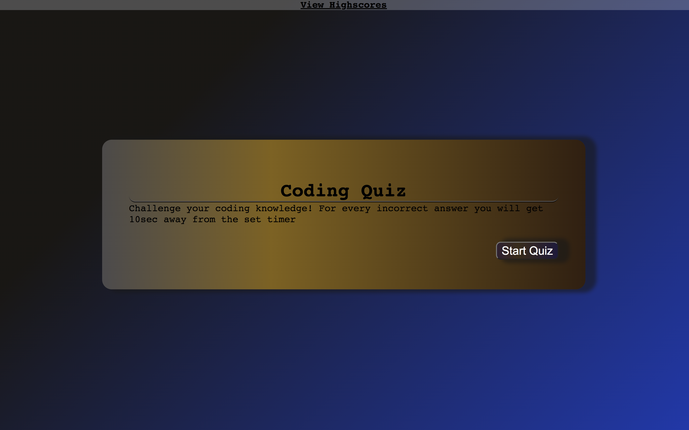
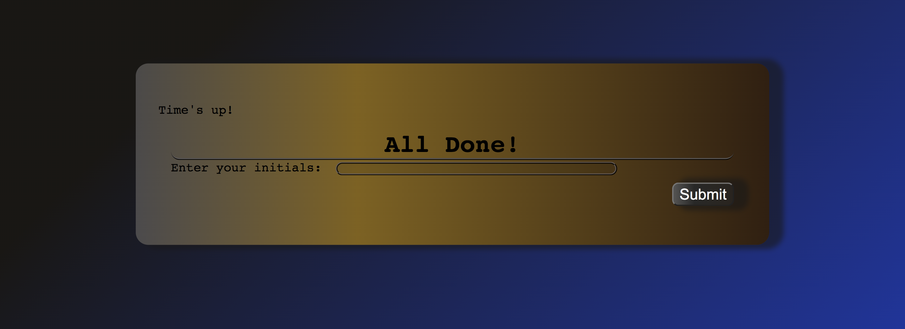
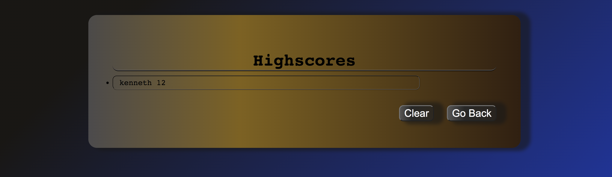

# Code-Quiz

## **Description**

* This project aimed to adapt Html,Css and Js to built a timer quiz. 
This project consist of a small set of coding question with selectable answer. Every question you get wrong you will get penalized by deducting 10 points from timer. 
After game is over it will prompt to save your score by typing your first name and last name initials.  
After submit. After submission, you will be prompted to a different page where you can see your score.

### **Code Learning Points**

- * One of the main porpuses of this project was to built an Timer clock. 

### HTML

- * First Step: Create a tag holder to place the Timing event [W3time](https://www.w3schools.com/js/js_timing.asp)

```html
 <div id="currentTime"></div>
  ```

### CSS
- * Second Step: By invoking the #IdCurrentTime it allowed me to target and style position where I wanted the time clock to be display at. [W3Float](https://www.w3schools.com/css/css_float.asp)


```css
#currentTtime {
  float: right;
}
```
- **After**

  * Added 

```css

```

## **Technology Used**

| Technology Used         | Resource URL           | 
| ------------- |:-------------:| 
| HTML    | [https://developer.mozilla.org/en-US/docs/Web/HTML](https://developer.mozilla.org/en-US/docs/Web/HTML)|  
| CSS     | [https://developer.mozilla.org/en-US/docs/Web/CSS](https://developer.mozilla.org/en-US/docs/Web/CSS)      |   
| Git | [https://git-scm.com/](https://git-scm.com/)     |    


## **Prerequisites**

**Install or open the internet browser of your choice.**

*  **Examples Below:**

- Google Chrome
- Safari
- OPera
- Mozilla Firefox
- Internet Explorer

### **Installing**

**Click the link below:** 

[Link to Website](https://cruzkenneth504.github.io/code-quiz/)

## **Built With**

* [HTML Dev](https://developer.mozilla.org/en-US/docs/Web/HTML)
* [HTML W3](https://www.w3schools.com/html/default.asp)   
* [CSS Dev](https://developer.mozilla.org/en-US/docs/Web/CSS)
* [CSS W3](https://www.w3schools.com/css/default.asp)

## **Visual**



## **Author**

* **Kenneth Cruz** 


- [Link to Portfolio Site]()
- [Link to Github](https://github.com/cruzkenneth504)
- [Link to LinkedIn](linkedin.com/in/cruzkenneth504)

       
## **License**

This project is licensed under the MIT License

## **Acknowledgments**

* [UCB BootCamp](https://bootcamp.berkeley.edu/)
* [DevTools](https://dev.to/)
* [Youtube](https://www.youtube.com/)
* [CssGradient](https://cssgradient.io/)
* [CssTricks](https://css-tricks.com/snippets/css/a-guide-to-flexbox/)
* [MozzilaBoxShadow](https://developer.mozilla.org/en-US/docs/Web/CSS/box-shadow)

## **Test 1**

 ## **Test 2**
